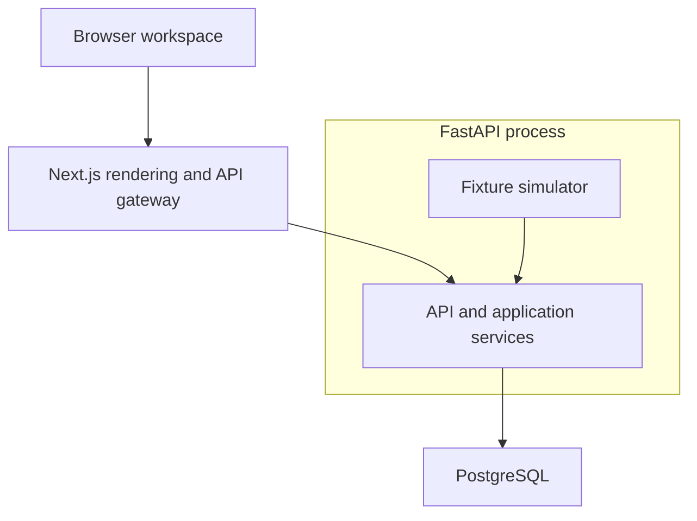
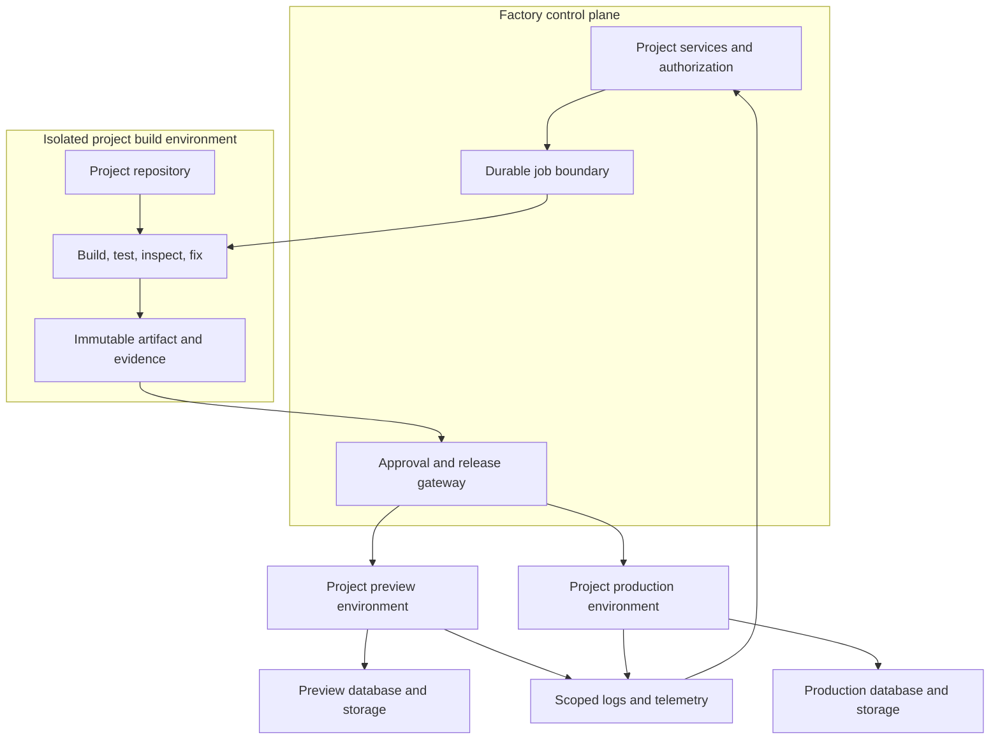

# F01 — System architecture

Status: Phase 1 M0–M6, Phase 2A and Phase 2B complete; Phase 2C documentation/planning only, implementation not started.
Revision: 0.15 · 2026-10-04
Related: [Product specification](PRODUCT_SPEC.md), [Design system](DESIGN_SYSTEM.md), [Roadmap](ROADMAP.md).

## 1. Architectural decision

Use one repository containing a Next.js web application and a modular FastAPI application backed by PostgreSQL. FastAPI owns domain validation, authorization, state transitions, and all domain writes. Next.js owns presentation, server rendering, and a thin same-origin API gateway. The gateway has no independent business rules and no direct domain database access.

The factory remains a modular monolith: Next.js presents the workspace/BFF, FastAPI owns domain writes, and PostgreSQL owns history and execution state. Phase 2B adds separate trusted leased-worker and preview-gateway processes; generated source runs only in isolated Docker containers. Production release remains unimplemented. The table below records historical Phase 1 decisions; later accepted boundaries extend them.

| Concern | Phase 1 decision | Reason |
| --- | --- | --- |
| Web | Next.js App Router, React, strict TypeScript, Tailwind | Structured routing, reusable UI, typed rendering |
| Domain API | FastAPI, Pydantic contracts | One authoritative domain boundary |
| Persistence | PostgreSQL, SQLAlchemy, Alembic migrations | Transactions, ownership relations, immutable history |
| Contracts | FastAPI OpenAPI → generated TypeScript types/client | Avoid hand-maintained competing DTO definitions |
| Browser transport | Same-origin `/api/v1` gateway | Keep internal credentials server-side and simplify cookies |
| Live updates | Server-sent events with persisted replay; polling fallback | One-way project progress needs no socket protocol |
| Identity | Explicit local/private development adapter | Authentication-ready without pretending to have production auth |
| Execution | Versioned deterministic fixture simulator | Exercise the lifecycle without executing generated code |
| Project memory | Typed Brain revisions plus relational records | Traceable context without a vector database |
| Preview | Bundled fixtures on internal preview routes | Inspectable demonstration with an explicit trust boundary |
| Extension boundaries | Execution boundary plus implemented `PlanningProvider` protocol | Keep provider and infrastructure choices replaceable |

Pin compatible released runtime and dependency versions during milestone M1 and commit lockfiles. This proposal does not depend on a particular Next.js or model SDK version.

### Architecture delivery layers

| Layer | Boundary |
| --- | --- |
| Implemented | Completed Phase 1 persistence/workspace/simulation; 2A verified OIDC sessions and persisted contextual proposals; 2B authorized source generation, scoped immutable candidates/evidence, PostgreSQL leased execution, trusted Docker verification/repair, atomic version/Brain publication and isolated preview gateway. Domain authorization and generated contracts remain authoritative. |
| Phase 1 acceptance | M0–M6 are complete. The existing nine-table schema, frozen migration, backend services and generated contracts are unchanged by M6. |
| Long-term platform | Section 13 relates completed source/execution boundaries to proposed production hosting, operations, visual editing, team authorization and outcome seams. Future seams do not add current routes, models, infrastructure or milestones. |

M2–M6 and Phase 2A/2B are complete. The completed repository state at `f9c2a69` records accepted image `sha256:bf55945a66450b4d747196aed159eba926ca377b66e41400da70c0a54e3363c0`, passing Docker containment and signed-in build/repair/change/failure acceptance, 289 backend tests passed/2 skipped and passing frontend typecheck/build. [PHASE2B_IMPLEMENTATION.md](PHASE2B_IMPLEMENTATION.md) records the completion evidence and historical checks. Preserve modular adapters and existing history. [PHASE2C_IMPLEMENTATION.md](PHASE2C_IMPLEMENTATION.md) is a bounded proposal: no production code, selected provider, resources or public release URL exist yet.

## 2. Target topology and future seams

This diagram is the historical Phase 1 topology. Current 2B additionally has a private Docker worker and separate cookie-host preview gateway using network-disabled generated containers. API processes do not operate the Docker socket. External production hosting remains the proposed 2C seam.



Server components use a server-only API client directly against FastAPI. Client components use the same contract through `/api/v1`. Authorization occurs in FastAPI for both paths. The browser never sends a trusted user-ID header.

The simulator operates inside the backend process, using the same transaction services as API commands. It is not an autonomous agent or a general job worker.

| Boundary | Historical Phase 1 | Accepted extension / proposed next step |
| --- | --- | --- |
| Identity resolver | Development principal from an internal development token | Verified access token from a selected identity provider |
| Planning source | Standalone `PlanningProvider` + OpenAI draft endpoint; workspace simulation remains separate | Context-aware planning connected to persisted Brain revisions |
| Execution driver | Due fixture steps with persisted cursor | Implemented PostgreSQL jobs/fenced leases and private isolated Docker worker; Redis is not required |
| Preview descriptor | Allowlisted internal fixture ID | Implemented source-bound runtime/capability on a separate cookie host |
| Deployment record | Simulated record with no external URL | Provider adapter with real evidence and credentials |

Do not create a large adapter framework or empty provider packages now. Define small interfaces only where used by Phase 1. No provider SDK types may become domain models. Future models consume an assembled project context and return validated domain proposals; model output is never an instruction to execute arbitrary tools directly.

## 3. Proposed repository structure

This historical structure sketch began with the early web shell, standalone planning and M2 persistence/domain/core APIs. Current implementation also contains the completed 2A identity/context and 2B source/execution/preview modules. The table includes proposed paths for later milestones; it is not a claim that every listed module exists.

| Path | Responsibility |
| --- | --- |
| `PRODUCT_SPEC.md`, `ARCHITECTURE.md`, `ROADMAP.md`, `DESIGN_SYSTEM.md` | Root source-of-truth documents |
| `apps/web/src/app/(auth)/sign-in/` | Identity connection/development entry screen |
| `apps/web/src/app/(product)/projects/` | Dashboard and create-project routes |
| `apps/web/src/app/(product)/projects/[projectId]/` | Workspace layout and project subroutes |
| `apps/web/src/app/(product)/account/` | Identity and account information |
| `apps/web/src/app/api/v1/[...path]/route.ts` | Allowlisted API gateway including stream forwarding |
| `apps/web/src/app/api/v1/plan/route.ts` | Implemented server-only planning route; only POST to the fixed FastAPI endpoint |
| `apps/web/src/app/(preview)/demo-preview/[fixtureId]/` | Independent HTML fixture responses and bundled CSS/classic-script asset routes |
| `apps/web/src/components/ui/` | Accessible button, input, dialog, sheet, tabs, table, skeleton primitives |
| `apps/web/src/components/shell/` | Global rail, project header, navigation, inspector shell |
| `apps/web/src/features/projects/` | Dashboard, project creation, settings |
| `apps/web/src/features/project-planning/` | Implemented brief submission and structured draft plan rendering |
| `apps/web/src/features/workspace/` | Layout coordination, preview controls, request drawer |
| `apps/web/src/features/brain/` | Structured Brain rendering and provenance |
| `apps/web/src/features/build-trace/` | Timeline, event reducer, stream/reconnect handling |
| `apps/web/src/features/versions/` | Version list and selected-preview state |
| `apps/web/src/features/project-pulse/` | Shared functional state indicator |
| `apps/web/src/lib/api/` | Browser/server API wrappers, normalized errors |
| `apps/web/src/lib/planning/` | Implemented bounded plan contract, safe error catalog, and server-only backend request boundary |
| `apps/web/src/lib/auth/` | Server-only identity adapter and route checks |
| `apps/web/src/lib/config/` | Validated public/server configuration |
| `apps/web/src/styles/` | Tokens, typography, base styles, reduced-motion rules |
| `apps/web/src/fixtures/previews/` | CRM and generic demo UI using synthetic data |
| `apps/web/tests/` | Interaction tests and end-to-end journeys |
| `apps/api/src/f01/main.py` | App factory, lifespan, router wiring |
| `apps/api/src/f01/api/v1/` | Routers, request/response schemas, error mapping |
| `apps/api/src/f01/application/` | Use cases: creation, requests, runs, Brain, versions, archive |
| `apps/api/src/f01/domain/` | Enums, state transitions, validated Brain structures, invariant helpers |
| `apps/api/src/f01/domain/planning.py` | Implemented provider-independent Pydantic project plan |
| `apps/api/src/f01/providers/` | Implemented planning protocol, factory, OpenAI HTTP adapter and safe provider errors |
| `apps/api/src/f01/db/` | Session/unit-of-work helpers, mapped tables, focused query functions |
| `apps/api/src/f01/auth/` | Principal resolution and project ownership enforcement |
| `apps/api/src/f01/execution/` | Fixture runner, scenario definitions, clock abstraction |
| `apps/api/src/f01/config.py` | Environment validation and production startup guards |
| `apps/api/migrations/` | Alembic revisions and migration configuration |
| `apps/api/tests/` | Domain, transaction, contract, authorization, replay, runner tests |
| `packages/api-client/` | Generated TypeScript contracts/client and generation command |
| `tests/e2e/` | Cross-runtime product acceptance scenarios |
| `.env.example` | Documented non-secret configuration examples |
| `package.json`, `pnpm-workspace.yaml`, `pnpm-lock.yaml` | Small web workspace and scripts |
| `apps/api/pyproject.toml`, `apps/api/uv.lock` | Python dependency definition and lockfile |

App Router pages stay thin: compose a feature and handle route-level loading/errors. Feature components own interactions; reusable primitives own styling and accessibility. Python routers handle HTTP concerns; application services coordinate transactions; domain code validates state. Avoid a repository abstraction around every table, a global frontend store, or a UI package used by only one app.

## 4. Phase 1 domain and database model — historical baseline

This section preserves the original migration and simulation contracts. Phase 2A and completed Phase 2B extend them below; simulation-only restrictions here are not current restrictions on real builds/versions. Production release tables do not exist yet.

### Standalone planning extension (implemented)

`POST /v1/plan` accepts `{ "idea": "Build a CRM for a small real estate agency." }`. The trimmed idea must contain 1–10000 characters. Input is a strict Pydantic object with no extra properties. Caller-supplied provider credentials, models and URLs are not accepted. Authentication uses `Authorization: Bearer <DEV_API_TOKEN>`, checked against backend settings with constant-time comparison. This is the existing local development identity boundary; health remains unauthenticated.

The `ProjectPlan` response has six required fields: `project_title` (1–100 characters), `product_summary` (1–1000 characters), `target_users` (1–10 strings), `core_features` (1–16 objects with `name`/`description`), `recommended_stack` (`frontend`, `backend`, `database`, `rationale`), and `implementation_milestones` (1–12 ordered objects with `title` and 1–10 `deliverables`). Nested objects forbid extra properties and validate text lengths. The Pydantic model in `domain/planning.py` is the executable contract exposed in OpenAPI.

The route depends on `PlanningProvider.create_plan(idea) -> ProjectPlan`. Only `OpenAIPlanningProvider` knows OpenAI wire formats. HTTPX is a runtime dependency; provider SDK types do not enter domain models. Future adapters implement this protocol and are selected in the factory without changing the endpoint schema.

The adapter calls the fixed HTTPS Responses endpoint with a strict JSON schema derived from `ProjectPlan`. Defaults are `gpt-4.1-mini`, a 30-second total deadline, and 3000 output tokens. Requests use `store=false`, no tools, no redirects, no environment-proxy inheritance and no automatic retries. Clients are closed after each request. Refused, incomplete, malformed and schema-invalid results are rejected. A result containing the configured key is rejected.

Errors use the standard `{ "error": { "code", "message", "request_id", "details": {} } }` envelope and `X-Request-ID`. Safe application-owned codes distinguish caller authentication (401), input validation (422), missing key (503), provider authentication (502), quota (503), rate limit (429), timeout (504), provider unavailability (503), invalid/incomplete output (502), refusal (422), other provider failure (502) and unexpected adapter failure (500). Exact codes are listed in the README and the HTTP error mapping. Raw provider messages, refusal text, exception messages, validation inputs and credentials are never returned or logged by these modules.

Planning is stateless: no database, Brain, version, event or deployment writes. Repeated submissions make separate provider calls; durable planning idempotency is not implemented. Backend tests inject mock HTTP transport while exercising the actual router, factory, adapter and domain validation; they use synthetic credentials and make no network calls.

### Frontend draft planning integration (implemented)

`/projects/new` submits only `{idea}` to `POST /api/v1/plan`. The Node.js route delegates to a module marked `server-only`, reads `API_INTERNAL_URL` and `DEV_API_TOKEN` from private frontend server configuration, and sends the token to the fixed `/v1/plan` backend path. It never reads `apps/api/.env` or the OpenAI key. Next.js configuration loads only an allowlist of web settings from the project-root `.env`; already-defined process/app environment values take precedence.

The route rejects missing/cross-origin submissions, mismatched configured origins, non-JSON requests, oversized bodies, and invalid ideas before upstream access. Localhost and loopback addresses may share the configured scheme/port; non-local operation requires an explicitly private preview configuration. Backend origins must be HTTPS or loopback HTTP and cannot contain credentials, paths, query parameters, or fragments. The route forwards no caller identity headers, arbitrary URL, provider setting, or upstream response headers. Both runtimes still reject production operation with development identity; this is not a public authentication system.

Requests have a 128 KiB body limit, upstream responses a 256 KiB limit, and a 130-second frontend server deadline to cover the backend's supported maximum 120-second provider deadline. No automatic retries or redirect following occur. Successful plans are checked against a bounded TypeScript mirror of the Pydantic contract before rendering; no provider types enter the frontend. OpenAPI export and generated TypeScript client now exist in `packages/api-client`; the existing bounded planning response validator remains intact. Unknown errors, raw diagnostics, malformed plans, and credential-bearing responses are discarded. Only static error messages and a validated request reference are returned; backend caller-authentication failure becomes frontend service-configuration failure. Responses use `Cache-Control: no-store`.

The form preserves the brief on failure, prevents duplicate pending submissions, provides cancellation and a 140-second browser deadline, focuses the plan after success, and labels it as unsaved with no build started. Editing the brief marks the displayed plan as based on the previous submission. Cancellation clears the browser result and propagates an abort where the transport supports it; it does not guarantee reversal of an already-started provider request or charge. Tests exercise the server boundary and production browser flow with synthetic credentials and controlled upstream responses.

### Planned persistent domain

All identifiers are UUIDs. Timestamps use PostgreSQL `timestamptz`, serialized as UTC ISO 8601. JSON structures are validated with a versioned Pydantic schema. Enum-like database columns use text plus CHECK constraints to make migrations straightforward. `?` denotes nullable fields below.

### Core tables

| Table | Principal fields | Purpose |
| --- | --- | --- |
| `users` | `id`, `identity_issuer`, `identity_subject`, `display_name`, `email?`, `created_at` | Stable internal owner; no password storage |
| `projects` | `id`, `owner_user_id`, `title`, `lifecycle`, `current_brain_revision_id`, `current_version_id?`, `metadata_version`, `event_sequence`, `status_event_sequence`, `last_activity_at`, `archived_at?`, `created_at`, `updated_at` | Project aggregate and transactional UI projections |
| `project_requests` | `id`, `project_id`, `created_by`, `kind`, `text`, `base_brain_revision_id?`, `base_version_id?`, `created_at` | Immutable original brief and subsequent change intent |
| `brain_revisions` | `id`, `project_id`, `revision`, `schema_version`, `source_request_id`, `source_run_id?`, `content` JSONB, `created_at` | Immutable structured dossier revision |
| `build_runs` | `id`, `project_id`, `request_id`, `input_brain_revision_id`, `base_version_id?`, `retry_of_run_id?`, `attempt`, `mode`, `status`, `phase?`, `scenario_id`, `scenario_version`, `step_cursor`, `next_step_at?`, `last_heartbeat_at?`, `error_code?`, `created_at`, `started_at?`, `finished_at?` | One simulated attempt using frozen inputs |
| `build_events` | `id`, `project_id`, `run_id?`, `request_id?`, `sequence`, `deduplication_key?`, `type`, `phase?`, `severity`, `message`, `mode?`, `payload` JSONB, `occurred_at` | Append-only trace and activity source |
| `project_versions` | `id`, `project_id`, `number`, `run_id`, `brain_revision_id`, `mode`, `summary`, `preview_descriptor` JSONB, `created_at` | Successful simulated output metadata |
| `deployment_records` | `id`, `project_id`, `version_id`, `run_id`, `mode`, `target`, `status`, `external_url?`, `created_at`, `completed_at?` | Simulated release information; no real deployment operation |
| `idempotency_keys` | `id`, `user_id`, `method`, `route_scope`, `key`, `request_hash`, `response_status`, `response_body` JSONB, `created_at`, `expires_at` | Safe command replay after duplicate submit or lost response |

In Phase 1, `build_runs.mode` and version/deployment modes accept only `simulated`. User-action events have null execution mode. `deployment_records.target` is `internal_fixture`, and `external_url` must be null for simulated rows. The initial request has null base references; change requests require a base Brain revision. Source-code artifacts, Git commits, actual tests, files, and model usage are not implied by these records.

### Relationships and constraints

- A user owns many projects. A project owns its requests, Brain revisions, runs, events, versions, and deployment records. Phase 1 has one owner per project; no workspace/team tables or invitations.
- Identity is unique on `(identity_issuer, identity_subject)`; email is not the identity key.
- Brain `(project_id, revision)`, event `(project_id, sequence)`, and version `(project_id, number)` pairs are unique. Revision, event sequence, version number, and attempt are positive integers; project sequence counters may start at zero.
- A partial unique index permits only one run with status `queued` or `running` per project.
- Each successful run creates at most one output Brain revision, one version, and one simulated deployment record. Enforce uniqueness on output `source_run_id`, version `run_id`, and deployment `run_id`.
- All cross-references must belong to the same project. Use composite foreign keys with `(project_id, id)` targets for request/run/revision/version links, including project current pointers. Validate author ownership in application services.
- Create the initial project, request, revision, run, and event in one transaction with preallocated UUIDs. The project-to-current-Brain foreign key is deferrable to resolve the insertion cycle; it is non-null at commit.
- Use row locks on the project to allocate event/revision/version numbers and serialize transitions. Do not use `MAX(...) + 1` without the project lock.
- Requests, Brain revisions, events, and versions are immutable through public APIs. Run fields and project projections are controlled updates.
- Archive is reversible and retains history. Reject archive and new changes while a run is active; the user can cancel first. Archived projects can be inspected, renamed, and unarchived, but cannot start runs.
- Do not add a destructive delete endpoint in Phase 1. Retention, account deletion, and audit erasure policies must be settled before commercial launch.

Indexes: owner/archived/updated project listing; requests by project/time/ID; Brain by project/revision; runs by project/time and active status; events by project/sequence and run/sequence; versions by project/number; deployments by version; idempotency uniqueness by user/method/route/key and expiry. Add JSONB indexes only for demonstrated queries; relational filtering should not depend on scanning Brain JSON.

### Brain content schema

`brain_revisions.content` is a typed snapshot, not raw model output or a generic transcript:

| Section | Shape and rules |
| --- | --- |
| `original_request_id` | Stable reference to the initial brief |
| `product` | Summary and requirements with stable `requirement_id`, source, priority, acceptance criteria, assumption flag |
| `plan` | Ordered steps with stable IDs, phase, requirement references, dependencies, proposed status |
| `architecture` | Overview, component relationships, rationale, proposed/simulated evidence |
| `stack` | Intended generated-project tools and rationale; separate from factory configuration |
| `database` | Proposed entities, fields, relationships, and unresolved choices; no generated database |
| `features` | Stable feature IDs, linked requirements, requested/planned/simulated state |
| `design_decisions` | Decision ID, choice, reason, source, superseded decision reference where applicable |
| `constraints`, `open_questions` | Explicit constraints and unresolved assumptions |
| `history` | Referenced request IDs, issue IDs, event sequences, version IDs, deployment IDs |

Each substantive entry has provenance: `user_request`, `template`, or `simulation`, with the relevant request ID, fixture reference, or run/event references. Schema version starts at 1. Migrations/read adapters handle future versions; an unknown version renders a safe unsupported-schema state instead of silently dropping fields.

Brain is a view over the current immutable revision plus canonical requests, issue/resolution events, versions, and deployment records. `GET /brain` assembles these references deterministically. Issue summaries use `issue_id` and `resolves_issue_id` in validated event payloads; no separate bug database is needed yet.

Successful updates preserve unchanged requirement/feature IDs and point explicitly to superseded decisions. A future context assembler selects relevant sections and linked evidence under a token budget. Vector search is deferred until project size demonstrates a need.

### M2 implementation details

- `apps/api/src/f01/db/models.py` maps exactly the nine Phase 1 tables. Frozen migration `0001_phase1` creates tables, named constraints/indexes, then deferred cyclic foreign keys. It also protects immutable requests/Brain/events/versions, frozen run inputs and terminal transitions, active-run/archive exclusion, and complete idempotency results at commit.
- `application/projects.py` coordinates owned project access, row-locked metadata writes, atomic creation/replay, sequence allocation and reads. Development identity resolves centrally from the authenticated server configuration; caller identity headers are ignored. `(project_id, created_by)` also references the project's owner in Phase 1.
- Initial Brain schema version 1 validates all planned sections, stable entry IDs, dependency/requirement references and provenance. Generated acceptance criteria carry template provenance. Initial content preserves the exact trimmed brief and explicitly leaves product detail unresolved. Unknown schema versions return `UNSUPPORTED_BRAIN_SCHEMA`; no write endpoint exists.
- Create stores a server-selected `crm-success` or `generic-success` scenario at version 1 with `queued` status, no scheduled tick and no version/deployment. M2 performs no simulation, code generation, model call or deployment. Reads never progress runs. Domain transition functions define legal status/phase transitions and the linked repair exception for later execution.
- Idempotency keys are 1–200 ASCII letters/digits or `. _ : -`, scoped to user/POST/canonical route, hashed from validated normalized JSON, retained 24 hours. Reservation, initial records and the saved 201 response commit together. A two-second lock wait may return `IDEMPOTENCY_IN_PROGRESS`; retry the same key. Expired reservations are replaced transactionally. Replay returns the original snapshot/IDs and Location for rereading current state.
- Project ETags are `"project-{uuid}-m{metadata_version}"`. GET/create/PATCH return them; PATCH requires exact `If-Match` (428 absent, 412 stale). A real title/archive change increments metadata once and appends attributed activity. A no-op preserves the ETag. Run/Trace changes do not change it. Multi-field PATCH is atomic.
- Workspace and Brain/context/history reads use PostgreSQL REPEATABLE READ transactions. Workspace events are ascending, limited to the latest 20, with the same snapshot high-water sequence. Project/request/revision lists use validated cursors, default 20 and maximum 100; projects filter by title/status/archive. Canonical Brain context is deterministic and project scoped.
- `/v1/session` adds `simulation_runner: false` to the approved false capabilities. `/v1/health/ready` requires DB access and migration `0001_phase1`; `/health/live` and standalone planning do not require a live DB connection. Engines are created lazily at lifespan startup without migrations or simulation tasks and disposed on shutdown. Schema export does not load environment credentials or connect to PostgreSQL.
- `packages/api-client/openapi.json` and `src/schema.ts` derive from FastAPI; `pnpm api:generate` regenerates and `pnpm api:check` detects drift. Its `server-only` transport accepts private configuration, rejects credential/path-bearing origins, disables redirects and caching, and returns typed resources/error envelopes plus response headers. Browser code may import schema types only. No new frontend persistence gateway or journey is implemented in M2.


### M4 implementation details

- Added `POST /projects/{id}/requests`, `GET /projects/{id}/events`, `GET /projects/{id}/versions` and `GET /projects/{id}/versions/{versionId}`. All operations check ownership; events use ascending server sequences and `after_sequence`; versions use numbered cursor pagination. No stream or run commands exist.
- Request creation reserves an identity/route-scoped 24-hour receipt, locks the project, checks archived/current Brain/current version/active-run constraints, and atomically saves the immutable request and `request.recorded` event with its replay response. Replays recover the original request before rechecking changed context. Failed commands leave no receipt/request/event. Metadata ETags, Brain and version pointers, and the original brief are unchanged.
- Fixed generated-client gateways expose only these reads/writes and the existing M2 Brain/request/workspace reads. Origin checks, bounded JSON, private identity, no-store and sanitized errors are preserved. The browser retains only unresolved frozen command receipts in tab session storage.
- A shared project layout keeps navigation, request draft/scroll state, inspector selection and viewport preferences in memory across subroutes and responsive changes. Stale Brain/version results retain text, require explicit current-context review, and use a new command only after a definite rejection.
- `/demo-preview/{crm-v1|generic-v1}` serves only allowlisted static synthetic data. The HTML response CSP and iframe both restrict sandbox to `allow-scripts`; same-origin, popups, downloads and top-navigation permissions are absent. `connect-src`, `form-action`, `frame-src`, `object-src` and `base-uri` are `none`; framing is self-only. There is no identity access, external URL, raw brief HTML, fixture API call, storage or factory hydration. Both fixtures are verified interactive under the pinned Next.js runtime.
- Pending projects show no iframe. Samples can be inspected separately at `/development/previews`, limited to development/test/private-preview configuration. Version descriptors can be inspected read-only when genuine persisted fixture metadata exists. M4 creates no versions or previews from a brief.

### M5 implementation details

- `execution/scenarios.py` holds immutable version-1 CRM/generic success, recoverable verification and terminal failure definitions. The FastAPI lifespan loop invokes `SimulationRunner.tick` on a bounded interval. Reads never tick. Old queued runs without a due timestamp are recovered; every active step rechecks status, cursor and due time under project-then-run locks. Cursor, next due time, events and lifecycle commit together. Fixture events use unique `(run, cursor, event index)` keys. Missing versions fail honestly with `SCENARIO_VERSION_UNAVAILABLE`.
- Owned start/cancel/retry and run/deployment history endpoints use the existing schema and generated client. Start requires `{request_id, expected_brain_revision_id}`; the saved request supplies the frozen version base. Retry accepts `{}` and creates a linked attempt with the same request/Brain/version. Start/retry receipts use the existing 24-hour scope and atomic response reservation. Cancellation accepts `{}`, is repeatable and contends on the same locks as success. A terminal winner is returned without a second terminal event.
- Success publishes an immutable Brain revision, version, simulated internal-fixture deployment, current pointers, run outcome and completion events in one transaction. New Brain content retains original intent and stable IDs, adds saved change intent and explicit simulation provenance, and freezes the canonical event/issue/version/deployment references at publication. Requirements remain requested/proposed, not asserted implemented. Failure creates no output records or pointer changes; cancel retains prior successful output. Requested changes can leave the fixture interface unchanged.
- The stream validates ownership, expiry and cursor before response headers. Header cursor wins over the query. Committed project events are replayed in ascending batches through unbuffered same-origin SSE; comments heartbeat every 15 seconds. Credentials are checked again after database reads and before data frames; ownership is checked each read batch. Optional UTC development-token expiry is configuration, not new production authentication.
- The browser backfills history against the snapshot high-water sequence, deduplicates deliveries and holds later sequences until missing events are fetched. Broken streams use read-only polling every three seconds and reconnect at bounded 1–15-second exponential delays plus jitter. Missing EventSource uses polling. History failures retain recent snapshot events and retry backfill. Transport health is separate from lifecycle. Brain/version/request resources refresh on relevant persisted events.
- Build Trace groups consecutive phases without reordering the global sequence, including repeated Building/Verifying groups for linked fixture repair. Its phase index names Understanding, Planning, Building, Verifying, Deploying and Live / Needs attention. Follow, pause, unread count and jump respect user scrolling and inspector resizing. Run/Brain/version selection is read-only. Unknown command outcomes retain exact separate keys/context across reload.
- Files, terminal logs and runtime remain honest unavailable capabilities. Deployment inspection shows only Simulation records with an internal fixture target and no external URL. The M4 fixture HTML/CSP/iframe permissions are unchanged. No dependency or migration was added.

## 5. Historical Phase 1 state and simulation mechanics

Project lifecycle: `idle | understanding | planning | building | verifying | deploying | live | error`.

Run status: `queued | running | succeeded | failed | canceled`. Run phase is one of the five active lifecycle phases; it is null before start. Terminal runs retain their last phase for diagnosis. Lifecycle is a persisted projection of current run outcome and available version, never a client-owned timer.

Normal sequence: queued → running/understanding → planning → building → verifying → deploying → succeeded. Success sets project lifecycle to `live`. A fixture repair may move verifying → building → verifying; this exception requires a recorded failure and a linked repair event. Failure sets lifecycle to `error`. Cancellation preserves the last successful version and returns lifecycle to `live` or `idle`.

Queued projects project the `understanding` lifecycle with a separate Queued run label. On successful completion, the output Brain revision, version, simulated deployment record, current Brain/version pointers, terminal run status, lifecycle, and completion events commit in one transaction. A failed run commits its failure and events but creates no output version or deployment and does not change the current Brain/version pointers.

The single supported Phase 1 backend process has a lightweight lifespan loop that checks due simulated steps. Steps are short database operations, never code execution. The persisted `scenario_id`, immutable scenario version, cursor, and `next_step_at` determine progress.

For each step, lock the project then its active run in a consistent order; recheck status/cursor/due time; apply the deterministic step; append events; update projections and schedule the next step; commit atomically. A crash before commit leaves no step outcome; a crash after commit cannot duplicate it on restart. Event payloads identify `(run_id, step_cursor, event_index)` and have a unique deduplication key for fixture events.

On restart, resume due runs from persisted cursors, emitting scheduled events in order. Preserve earlier scenario versions until their runs finish. If the scenario version is missing, terminate the run with `SCENARIO_VERSION_UNAVAILABLE` and a clear trace entry; never invent a replacement scenario.

Cancellation and success contend on the same locks. A committed cancellation prevents later steps from publishing a version. Retrying creates a new run linked by `retry_of_run_id`; it does not erase the failed run. Retry keeps the request and input Brain/version frozen. If current Brain no longer matches that frozen base, reject with a stale-context conflict and require a new reviewed request.

Initial CRM success, generic success, recoverable sample verification failure, and terminal sample failure are versioned scenarios. Failure fixtures are available through development test configuration, not arbitrary public request flags. A retry scenario is deterministic and can complete successfully; no real repair is asserted.

This loop is suitable for demonstrations in an always-running local/private backend. It is not a durable production execution worker and is not suitable for a request-only serverless runtime. Reads never advance simulation. Later, replace dispatch with a durable queue and worker while preserving the transaction and event contracts. A general `BackgroundTasks` callback is not used as the source of progress durability.

## 6. Frontend routes

Next.js route groups organize layouts without adding URL segments. Workspace inspector tabs are component state; URL query parameters represent shareable selections.

| Route | Behavior |
| --- | --- |
| `/` | Redirect to `/projects` for development/verified identity, otherwise `/sign-in` |
| `/sign-in` | Connection state; development entry only when enabled; no fake password form |
| `/projects` | Dashboard with `q`, `status`, `archived`, `cursor` query parameters |
| `/projects/new` | Optional title/original-brief save journey plus separate real draft planning; stable idempotency recovery |
| `/projects/[projectId]` | Persisted preview-first workspace; read-only real or demo version selection, persisted real/simulated run state and inspector selection |
| `/projects/[projectId]/brief` | Original brief and request history |
| `/projects/[projectId]/brain` | Current dossier; optional `revision` selection |
| `/projects/[projectId]/activity` | Project event history |
| `/projects/[projectId]/versions` | Immutable real/simulated versions, source metadata and preview selection; no production promotion yet |
| `/projects/[projectId]/settings` | Title, archive, capability information |
| `/account` | Current identity and development-mode disclosure |
| `/demo-preview/[fixtureId]` | Allowlisted synthetic demo HTML response, outside factory React layouts |
| `/api/v1/[...path]` | Allowlisted gateway to FastAPI; not an unrestricted reverse proxy |
| `/api/v1/plan` | Implemented same-origin POST gateway for draft planning; credentials stay server-side |

Project layouts share the rail, header, inspector, and request drawer. Preview responses have no factory shell and do not read identity cookies. The `(preview)` route handlers return complete independent HTML documents, bypassing factory React layouts and hydration. This allows bundled classic scripts and styles to load under an opaque origin while connections remain prohibited; no sandbox permission was relaxed. Loading, error, and not-found boundaries accompany dashboard and workspace routes. A missing or foreign-owned project presents the same not-found result.

## 7. API contracts

### Conventions

- FastAPI base is `/v1`; browser base is `/api/v1`. Every resource endpoint is ownership scoped.
- JSON property names use `snake_case`. Generated frontend types preserve these names; there is no global case-conversion layer.
- UUIDs are strings. Sequence, revision, and version numbers are positive 32-bit integers. UTC timestamps are strings. Validate lengths and enums on the server.
- Lists return `{ "items": [], "next_cursor": null }`. Default page size 20, maximum 100. Project cursors encode `(updated_at, id)` in descending order; trace pagination uses sequence. List pagination reflects current data and is not a frozen cross-page snapshot.
- Writes return authoritative resources, not optimistic invented records. Commands that create projects, requests, or runs (including retry) require `Idempotency-Key`, retained for 24 hours. Cancellation is inherently idempotent. Scope keys by identity, method, and canonical route. Reuse with different input returns 409.
- Metadata PATCH requires `If-Match` using a strong project ETag derived from `metadata_version`; return 412 on conflict. Trace ticks do not increment metadata version. A settings change or archive operation does.
- Domain conflicts return 409: `ACTIVE_RUN_EXISTS`, `PROJECT_ARCHIVED`, `STALE_BRAIN_REVISION`, `STALE_BASE_VERSION`, `IDEMPOTENCY_KEY_REUSED`, or `IDEMPOTENCY_IN_PROGRESS`.
- Validation returns 422; expired/missing identity 401; missing/foreign project 404; unexpected errors 500 with a request ID. Do not expose stack traces, internal tokens, or database errors.

Standard error body:

```json
{
  "error": {
    "code": "STALE_BRAIN_REVISION",
    "message": "This project has changed. Review the current brief before resubmitting.",
    "request_id": "a277d0f8-7d81-42e8-8af5-443012a9e6ac",
    "details": { "current_brain_revision": 3 }
  }
}
```

### Endpoint inventory

Paths below are relative to `/v1`. This is the historical Phase 1 inventory; accepted 2A/2B endpoints are listed in their implementation sections. Proposed 2C routes exist only in the plan, not as empty endpoints.

| Method | Path | Request / result |
| --- | --- | --- |
| POST | `/plan` | Implemented standalone real planning extension; `{idea}` → validated `ProjectPlan` |
| GET | `/session` | Principal, identity mode, supported capabilities |
| GET | `/projects` | Filtered cursor list of project summaries |
| POST | `/projects` | Title?, brief → project + initial request/Brain + queued run; 201 |
| GET | `/projects/{id}` | Project summary and metadata ETag |
| PATCH | `/projects/{id}` | Title and/or archived boolean + If-Match → project; 200 |
| GET | `/projects/{id}/workspace` | Consistent snapshot: project, current Brain, active/latest run, current version, preview, recent events, high-water sequence |
| GET | `/projects/{id}/brain` | Selected/current revision with canonical context references; `revision` optional |
| GET | `/projects/{id}/brain/revisions` | Revision summary list |
| GET | `/projects/{id}/requests` | Immutable request history |
| POST | `/projects/{id}/requests` | Change text + base Brain/version → recorded request; 201 |
| POST | `/projects/{id}/runs` | Recorded request ID + expected current Brain ID → queued simulated run; 202 |
| GET | `/projects/{id}/runs` | Attempt history |
| GET | `/projects/{id}/runs/{runId}` | Status, phase, timing, input references, error |
| POST | `/projects/{id}/runs/{runId}/cancel` | Cancel active run; 200; repeated cancel is safe |
| POST | `/projects/{id}/runs/{runId}/retry` | Retry a failed run using frozen inputs; 202 |
| GET | `/projects/{id}/events` | Events ordered ascending; `after_sequence`, `limit`, optional `run_id` |
| GET | `/projects/{id}/events/stream` | SSE replay/live stream; `after_sequence` or `Last-Event-ID` |
| GET | `/projects/{id}/versions` | Successful simulated versions, newest first |
| GET | `/projects/{id}/versions/{versionId}` | Version metadata + allowlisted preview descriptor |
| GET | `/projects/{id}/deployments` | Read-only simulated deployment records |
| GET | `/health/live`, `/health/ready` | Process liveness; readiness includes database and migration compatibility |

`/session.capabilities` declares `execution_mode: "simulated"`, `real_generation: false`, `external_deployment: false`, and `source_artifacts: false`. There is no Phase 1 Brain write endpoint, source execution endpoint, deployment command, or rollback command.

Create-project request:

```json
{
  "title": "Harbor CRM",
  "brief": "Build a CRM for a small real estate agency with authentication, leads, pipeline, notes and analytics."
}
```

Title is optional, trimmed, 1–100 characters when supplied. Brief is trimmed, 20–10,000 characters. Server chooses a transparent default title from the first brief line, capped at 60 characters, if absent. Server selects the allowlisted scenario; execution mode is not a client-controlled field. Return a project URL and IDs for the saved request, initial Brain revision, and run, plus `execution_mode: "simulated"`.

A change request requires trimmed `text` of 20–10,000 characters (matching the existing M2 database constraint), `base_brain_revision_id`, and `base_version_id` (nullable only when no successful version exists). Reject while a run is active. Starting it rechecks those bases against current pointers atomically. Duplicate run starts cannot bypass the active-run constraint. M4 offers “Record change request” only; it saves intent and attributed activity without modifying the original brief, revising Brain or starting a run. The M5 “Record and simulate” action first saves the request, then starts its run with a separate key; if start fails, the saved request remains available to resume.

Idempotency reservation, resource creation, and the saved success response commit in one transaction. Concurrent keys use a uniqueness constraint and a short wait or `IDEMPOTENCY_IN_PROGRESS` response; no duplicate resource is created. Replay returns the original creation identifiers even if the run has subsequently progressed; clients then read current state.

### Event and replay contract

Event types include `project.created`, `project.renamed`, `project.archived`, `project.unarchived`, `request.recorded`, `run.queued`, `run.phase_changed`, `step.completed`, `verification.failed`, `repair.recorded`, `verification.passed`, `version.created`, `deployment.simulated`, `run.succeeded`, `run.failed`, and `run.canceled`.

```json
{
  "id": "36311475-16a5-4399-b318-adad456830f7",
  "project_id": "2258ebc8-0b67-464b-91f5-e6d92d442cd9",
  "run_id": "63cfb22a-a52f-45e8-8f71-7f551d08cffb",
  "sequence": 12,
  "type": "verification.failed",
  "phase": "verifying",
  "severity": "warning",
  "mode": "simulated",
  "message": "Sample verification failed: callback route mismatch",
  "occurred_at": "2026-10-01T05:51:00Z",
  "payload": {
    "schema_version": 1,
    "issue_id": "sample-auth-callback",
    "scenario_step": 5,
    "recoverable": true
  }
}
```

Wire format uses `event: build_event`, `id: 12`, and JSON `data`. Event IDs are project-scoped sequences. The gateway forwards stream bytes without buffering and preserves the cursor; use native EventSource with same-origin cookies. Manual reconnect after a page reload uses `after_sequence`. If both cursor forms are supplied, the reconnect header takes precedence. Reject invalid or future cursors with 422 before opening the stream.

Read workspace and its high-water `last_sequence` in a consistent transaction. Subscribe after that sequence and replay all committed later events. Client applies events by sequence, ignores duplicates, and fetches missing gaps before applying later events. Delivery is at least once; ordering and reduction make repeated deliveries safe.

Keep all events during Phase 1, so valid old cursors remain replayable. A stream sends heartbeat comments every 15 seconds and reconnects with bounded exponential backoff (1–15 seconds plus jitter). Heartbeats do not create Trace entries. Poll `/events` at a modest interval if streaming is unavailable; polling is read-only. Stream transport health is separate from project lifecycle.

Recheck ownership and credential expiry during the stream. Expired credentials close the stream and prompt session renewal. Any host that terminates long streams must pass a documented polling fallback test. Client events trigger narrow resource refetches for Brain/versions/settings; they do not contain untrusted instructions or replacement HTML.

## 8. Historical Phase 1 authentication, tenancy, and fixture isolation

Completed 2A provides verified identity/session handling and completed 2B provides real preview isolation. The rules below remain development/fixture compatibility boundaries, not the sole current implementation.

Development mode uses one seeded internal user. Next.js holds `DEV_API_TOKEN` server-side and sends it to the private/loopback API. FastAPI maps that token to a configured development principal; it does not trust a caller-supplied subject. Tests use distinct seeded principals to verify ownership boundaries.

`AUTH_MODE=development` with `APP_ENV=production` must fail startup in both applications. Development access is only local or explicitly private. The sign-in screen says that real sign-in is not connected and offers development entry only when enabled. There are no custom password, session encryption, or token-minting implementations in Phase 1.

Later, the chosen identity provider handles sign-in and browser session management. Next.js passes a short-lived audience-bound access token; FastAPI verifies issuer, audience, signature, and expiry, then maps the external subject to the internal user. Every project route, command, list, and stream checks ownership. Team membership is a future core capability with the migration and authorization boundaries in section 13; it is not added to Phase 1.

For future cookie-authenticated mutations, verify origin and the selected provider/library's CSRF mechanism. The gateway allowlists routes/methods, never forwards caller identity headers, never exposes internal tokens, and never proxies an arbitrary URL. Reject client-controlled preview URLs.

Preview descriptors are a discriminated union. Phase 1 accepts only `{ "kind": "fixture", "fixture_id": "crm-v1" }` or `generic-v1`, optionally with validated fixture revision data. Render an iframe with title, restricted sandbox, and `allow-scripts` only; omit `allow-same-origin`, top navigation, popups, and downloads. Fixtures make no API calls, use no cookies/storage, and render no raw brief HTML. All synthetic data lives inside the fixture bundle. User input crosses only as validated display data, never code.

Use a dedicated preview response CSP: restrict resources to bundled assets, disallow connections/forms, and permit framing only by the factory. Verify the selected Next.js runtime supports the opaque-origin iframe and asset loading without weakening sandbox flags. If it does not, isolate previews on a separate origin; do not silently grant both scripts and same-origin access. Files and logs panels cannot fetch arbitrary file paths.

## 9. Configuration and operational boundaries

| Variable | Runtime | Rule |
| --- | --- | --- |
| `APP_ENV` | Both | `development`, `test`, `preview`, or `production`; validated |
| `AUTH_MODE` | Both | Development only in Phase 1; production guard |
| `DATABASE_URL` | API | Secret PostgreSQL connection string; never public |
| `API_INTERNAL_URL` | Web server | Fixed private FastAPI origin |
| `DEV_API_TOKEN` | Both servers | Secret dev token, never `NEXT_PUBLIC_*`; no default in hosted previews |
| `DEV_AUTH_SUBJECT` | API | Stable seeded development identity |
| `NEXT_PUBLIC_APP_URL` | Web | Non-secret public app origin only |
| `EXECUTION_MODE` | API | Must equal `simulated` in Phase 1 |
| `SIMULATION_TICK_MS` | API | 100–10000ms; default 1000ms |
| `SIMULATION_RUNNER_ENABLED` | API | Default true; false pauses due-step dispatch for controlled tests |
| `SIMULATION_CHANGE_SCENARIO` | API | `auto` default; `recoverable-verification`/`terminal-failure` only in development/test; never a public body flag |
| `DEV_TOKEN_EXPIRES_AT` | API | Optional timezone-aware expiry for development credentials; unset means no configured expiry |
| `LOG_LEVEL` | API | Validated level; exclude brief content and tokens by default |

Planning configuration is backend-only: `OPENAI_API_KEY` (SecretStr, required only for planning), `PLANNING_PROVIDER` (currently `openai`), `OPENAI_MODEL` (default `gpt-4.1-mini`) and `PLANNING_TIMEOUT_SECONDS` (default 30, greater than zero and at most 120). The blank backend template contains only `OPENAI_API_KEY=`. Model/timeout overrides may be set in backend environment configuration. No OpenAI key is exposed to Next.js or a `NEXT_PUBLIC_*` variable. Other provider and deployment secrets are documented when their adapters are implemented.

API logs include request ID, resource IDs, duration, status, and transition failures. Briefs, full Brain content, identity tokens, and raw model inputs are not normal log fields. Events are product records; operational logs are diagnostic records.

Use one local/private always-running backend for Phase 1. No deployment or hosting provider is selected or provisioned by this planning task. Separate factory hosting from future generated-project hosting.

## 10. Validation strategy and failure cases

Use a small set of meaningful checks rather than testing trivial style wrappers. Domain tests cover legal transitions, linked repairs, stale context, and cancellation. PostgreSQL integration tests cover transaction rollback, concurrent active runs, project-scoped foreign keys, idempotent creation, and atomic successful version publication. Do not substitute SQLite for these tests.

Contract tests verify OpenAPI/client generation, error shapes, capability flags, and unauthorized streams. Controlled-clock runner tests cover restart, duplicate ticks, unknown fixture versions, failure/retry, and success/cancel races. Web interaction tests cover input preservation, focus, responsive drawers, trace scrolling, and version inspection. Cross-runtime tests verify create/reload/change/archive and replay after a disconnected stream.

The full acceptance checks and milestone gates are in `ROADMAP.md`. Database migrations, liveness/readiness, and non-production auth guards must be verified before any shared private demonstration.

## 11. Tradeoffs and deferred decisions

- Two runtimes add local setup, but establish a clear boundary for future Python orchestration without duplicating domain logic in Next.js.
- A DB-driven simulator exercises persistence and replay, but must be replaced before real long-running generation.
- Single-owner projects keep Phase 1 small. Team membership requires a deliberate tenant migration before invitations are added.
- Immutable Brain snapshots make changes reviewable; compact structured snapshots and history references control duplication. Embeddings and pruning remain future work.
- Bundled previews demonstrate the product without proving arbitrary app generation. Demo disclosure is part of the contract.
- Identity configuration and future model choices remain decisions behind implemented abstractions. The trusted 2B stack is Next.js/React/TypeScript on pinned Docker. Generated-app production provider, artifact/profile/retention and commercial decisions remain open; the 2C proposal preserves authorization and event invariants.

## 12. Primary technical references

These references support framework capabilities. The domain model and architecture above are project proposals, not requirements prescribed by the frameworks. Consult the selected pinned versions again during implementation.

| Reference | Relevant support |
| --- | --- |
| [Next.js authentication guide](https://nextjs.org/docs/app/guides/authentication) | Session handling, authorization near data access, endpoint checks |
| [Next.js route groups](https://nextjs.org/docs/app/api-reference/file-conventions/route-groups) | Layout organization without URL segments |
| [FastAPI background tasks](https://fastapi.tiangolo.com/tutorial/background-tasks/) | Distinguishes small in-process tasks from heavier distributed work |
| [PostgreSQL partial indexes](https://www.postgresql.org/docs/current/indexes-partial.html) | Conditional uniqueness for active runs |
| [PostgreSQL JSON types](https://www.postgresql.org/docs/current/datatype-json.html) | Structured JSONB storage and indexing capabilities |
| [MDN server-sent events](https://developer.mozilla.org/en-US/docs/Web/API/Server-sent_events/Using_server-sent_events) | Event IDs, streaming format, browser reconnect behavior |

OpenAI extension references: [Structured outputs](https://developers.openai.com/api/docs/guides/structured-outputs), [GPT-4.1 mini](https://developers.openai.com/api/docs/models/gpt-4.1-mini) and [Error codes](https://developers.openai.com/api/docs/guides/error-codes). Checked on 2026-10-01. Account model access and live credentials are not inferred from documentation.

## 13. Future platform architecture — lifecycle and collaboration

This section aligns future architecture only. The existing Phase 1 schema, owner checks, one-active-run rule, simulated version semantics, API contracts, and implementation order above remain unchanged. A–K capability stages are defined in `ROADMAP.md`; each future schema or contract extension needs its own implementation proposal.

### Phase 2 implementation boundaries

| Stage | New authoritative boundary | Evidence/publication rule |
| --- | --- | --- |
| 2A complete — Identity and contextual planning | Verified identity/session adapter plus domain-owned context assembly and provider-independent planning | A proposal pins the authorized request, Brain revision and selected version. Validated model output and provenance are persisted as proposed work; stale publication is rejected. No source/build/deployment output is implied. |
| 2B complete — Generation, sandbox execution and real preview | Source/candidate storage, durable job orchestration, isolated execution and preview adapters | Actual commands produce sanitized evidence and immutable source identities. Bounded repairs reference observed failures. Verified source/build starts an isolated generated-app preview; unsuccessful candidates retain prior successful preview pointers. A portable production package is a separate 2C requirement. |
| 2C proposed — Production release and continued modification | Deployment adapter, environment-scoped release policy and public runtime records | Promote the reviewed verified production artifact, record observed URL/health and immutable history, and modify existing pinned source through the 2B pipeline. Failure cannot replace the last working production pointer. |

2A keeps stable existing project/history identities with a verified migration from development ownership. Session and tenant authorization are enforced in API commands, reads and streams. Context contains the original brief, immutable Brain/request history and selected version; 2B real generation additionally assembles authorized persisted source. Credentials remain outside prompts/Brain; absent source remains explicit. The standalone /v1/plan input/output contract remains separate from implemented project-aware proposals. Planning publishes no Brain revision.

2B generated code, build/test commands and preview servers never run inside FastAPI or the factory frontend process. Implemented PostgreSQL jobs/fenced leases, immutable source/evidence storage and a private Docker adapter own restart/cancel/retry/deduplication. Candidate, source, build attempt, evidence and preview retain separate identities. Actual execution creates real Trace evidence. The separate-host gateway/runtime denies factory credentials, metadata/network and other-project access. Dependency installation is controlled/offline/frozen with package scripts ignored.

2C separates preview from production configuration/data, isolates release credentials and binds promotion to exact source/artifact/evidence/configuration references. Publication records observed deployment outcomes without treating an external provider operation as a PostgreSQL transaction. Provider retries/reconciliation require stable operation identities and must not publish duplicate releases. Failed updates preserve the prior production release; current preview and current production pointers are separate. Incremental modifications pin their base source/version and Brain context and pass the same isolated verification/preview gates before redeployment.

2A and 2B are implemented and accepted. Only 2C production release remains a planning boundary. See ROADMAP.md and the completed 2B record for acceptance scope.

### Control plane, execution, and managed runtime

The FastAPI control plane owns project identity, authorization, requests, immutable context, workflow state, review policy, and release decisions. The Next.js workspace presents the control center without owning a separate domain database. Model providers return validated proposals; OpenAI, Claude, Gemini, or other adapters do not own project state or workflow protocols.

Each generated project eventually links its repository, isolated build environment, preview environment, production environment, database/storage, logs, and version/deployment records. Build and runtime resources are project-scoped; preview and production use separate configuration and data boundaries. Managed hosting may use multiple infrastructure providers behind the same application-owned contracts.

The following is a future trust-boundary diagram, not the current deployed topology:



Generated user code, dependency install scripts, builds, tests, and application servers must never execute in the platform's main backend process. Only isolated execution/runtime adapters may run them. The Phase 1 fixture loop remains short database simulation work, not a route for executing source code.

| Future execution control | Required contract |
| --- | --- |
| Isolation | Sandbox/container per build with a validated boundary; no privileged host access, control-plane mounts, shared project work directories, or access to the host container control socket |
| Resource limits | Explicit CPU, memory, wall-clock/runtime timeout, disk and process limits, applied before execution |
| Network controls | Deny access to the control plane, other tenants, and infrastructure metadata; allow only destinations required by the approved job policy |
| Safe commands | Execute declared command arguments and working directories; never interpolate a natural language request into a shell command. Treat repository scripts as untrusted code even when commands are valid. |
| Secret injection | Only scoped project/environment secrets needed for the job; no platform model keys, internal development token, factory database credentials, or infrastructure administration credentials |
| Cleanup | Cancel/timeout termination, resource teardown, scratch/data cleanup, and tested recovery after worker failure; retain only authorized artifacts and evidence |
| Audit and evidence | Traceable initiating actor, project, candidate, commands, resource policy, outcomes, and sanitized evidence; no secret-bearing diagnostics |
| Deployment separation | A release adapter deploys an approved immutable artifact; build workers cannot directly authorize production promotion |

Isolation and resource enforcement must be demonstrated before real execution is offered. Durable orchestration owns restart, deduplication, cancellation, retry/time budgets, and artifact provenance. Failure or exhausted repair attempts creates an intelligible result while preserving the previous working release.

### Source, changes, versions, and deployment lineage

Keep source revisions, change candidates, build attempts, artifacts, review decisions, deployments, and running instances as distinct concepts. Phase 2B already extends `project_versions` with real verified source/preview while preserving simulated history. The future release boundary permits multiple deployments of one verified version. A significant AI modification retains its own candidate and provenance even if verification fails; it becomes a verified version only after passing publication gates. Failed candidates do not replace current preview or production.

| Future concept | Minimum lineage to preserve |
| --- | --- |
| Source/change candidate | Project, requesting/authoring actor, request, base commit/version, base Brain revision, working branch, scoped change plan, and file diff/summary |
| Build attempt/artifact | Candidate and source digest, verification results, sanitized logs, migration/configuration requirements, artifact digest, and bounded repair history |
| Review decision | Reviewer identity, exact candidate/artifact and evidence, policy version, approve/request-changes result, comments, and time |
| Deployment | Project/environment, approved version/artifact, effective configuration/secret revision references, initiating/approving/deploying actors, observed result, and preview/production URL |
| Runtime/resource record | Project/environment, deployment/version, instance/service and database/storage references, health/log sources, and permitted operations |

A natural language or visual change loads authorized Brain context, inspects the pinned repository, creates a candidate branch, applies a bounded patch, verifies and repairs in isolation, publishes a preview, then requests review. Show the diff, affected behavior, verification, and migration/configuration impact before production promotion. Preserve stable requirement/file references and unrelated code; never unnecessarily regenerate an existing app.

Bind approval to the source/artifact, relevant environment configuration references, and verification evidence. Changing any bound input invalidates that approval. At promotion, recheck the base, current permissions, policy, and required approvals. Promote the artifact that was reviewed rather than silently rebuilding a different one. Record the successful release and Brain update under a consistent publication rule; unsuccessful attempts retain their evidence without changing the last working release.

Rollback selects a compatible previous artifact/deployment and creates a new audited release decision. Selecting an older preview is still inspection only. Database migration and external-action effects require an explicit recovery or remediation plan; a source rollback does not reverse them automatically. Redeploy/restart controls target a specific project environment and deployment, never a platform-wide process.

### Organization and team persistence extension

Future organizations are tenant/billing boundaries; workspaces contain projects; users can hold membership in more than one workspace. Projects resolve to one workspace, including a personal workspace for an individual owner. Project membership, permissions, and source/version authorship remain separate concepts. No organization/workspace tables, fields, invitations, or role claims are added now.

| Future model group | Purpose and compatibility requirement |
| --- | --- |
| Organizations/workspaces | Tenant, team/project container, ownership, plan/seat attribution, and policy. Stable project IDs survive moving the existing owner model into a personal workspace. |
| Memberships/role grants | Active user membership at an explicit workspace or project scope, role, capability restrictions, and revocation state. The chosen policy defines inheritance and exceptions. |
| Invitations | Email-targeted, expiring, single-use acceptance, inviter, intended scope/role, and revocation. Store token verifiers safely; acceptance requires the intended verified identity and cannot expand the inviter's grant authority. |
| Change ownership/reviews | Stable requesting/authoring/reviewing/approving/deploying actors and immutable candidate-bound review decisions. Ownership of a change is not permission to release it. |
| Comments/mentions/anchors | Workspace/project and change/version references, author, optional version-bound preview/source anchor, discussion state, and access-scoped mentions |
| Audit history | Actor type/identity, initiator and cause, scope, action, target, decision/outcome, time, and request/job references; redacted and append-only |

Before team access is enabled, migrate and backfill each legacy owner/project into a personal workspace without changing project IDs, original authors, source/version IDs, Brain revision IDs, or historical event sequences. Existing `owner_user_id` can remain a legacy ownership/creation reference during migration; it must not remain the sole authorization rule after team access is launched. Do not encode ownership into repository paths or resource IDs that would require rebuilding a project on membership changes.

Retain existing project-scoped composite foreign-key invariants. Future workspace/project/actor links must resolve to the intended tenant; denormalized scope fields require matching constraints. Requests already have `created_by`; later event/review/release records add typed actor and causal references rather than parsing attribution from messages. Historical authors may leave a team while their activity remains attributable under the retention policy.

Author checks belong in a centralized domain/application authorization service. The planned Phase 1 services use owner-only authorization; a later membership-aware policy replaces that decision without embedding team assumptions in Brain content, the provider adapter, or browser code. Future idempotency is scoped to the actor and authorized tenant/project operation. Cache entries, artifact URLs, streams, and background jobs must preserve the same scope.

### Roles, reviews, and permission enforcement

| Role | Future default action boundary |
| --- | --- |
| Owner | Ownership/policy/member/billing administration and permitted project/release operations |
| Admin | Delegated member and operational management, review, and production release under policy; no implicit ownership transfer |
| Builder | Create change requests/candidates and previews, inspect evidence, and discuss; production release is a separate grant |
| Reviewer | Read candidate preview/diff/Brain/Trace, comment, approve, or request changes; approval alone cannot deploy |
| Viewer | Authorized read-only project/preview/history access; no candidate, review, or runtime mutations |

Check a principal's action, project/workspace scope, environment, active membership, and applicable policy server-side. Model secret replacement, data mutations, deployment, rollback, restart/redeploy, member administration, and billing as explicit capabilities. No role has a workspace API to reveal a stored secret value. The frontend displays capabilities but cannot confer them; neither caller headers nor model output establish identity, role, approval, or tenant.

For Builder → system change/verification/preview → Reviewer approval → production release, preserve each actor and exact candidate. Requesting changes blocks promotion until the revised candidate is reverified and reviewed. Enforce any required independent review rule in policy, not a button state; a Builder cannot satisfy an independent-review requirement by submitting their own approval. Default production review is human, and release remains a separate authorized operation.

Recheck access on streams, queued jobs, sensitive operations, and release execution. Revoked membership removes future access and pending privileges; do not erase audit history or pretend revocation undoes completed external effects. Concurrent candidates retain frozen bases and use conflict/rebase checks before publishing shared Brain/source heads. Parallel branches and any relaxation of the Phase 1 one-active-run constraint require an explicit future migration, not an implicit change now.

### Runtime, environments, databases, domains, and logs

Managed runtime adapters expose typed, project/environment-scoped health, log/error inspection, restart, redeploy, migration, and recovery operations. Database controls access the generated project's resources, never the factory database. Data-view/edit capabilities are explicit; provide bounded tools, previews of changes, backups/recovery where required, and audited mutation rather than forwarding arbitrary commands to the control plane.

Environment configuration separates preview and production. Secrets are created/replaced through a write-only interface and stored as encrypted/vault-backed references with version and access metadata. The control center exposes names, scopes, rotation/status metadata, and permitted replacement/deletion actions. Only trusted injection services obtain secret values for the authorized runtime; values never enter Brain, model context, source, Trace, browser responses, or normal logs. Classify public client configuration separately from secrets and reject accidental public placement of secrets.

Platform hosting/model administration credentials remain in the control plane. Build/runtime workers and generated applications receive only their project-scoped resources and explicitly granted secrets. Keep preview and production database/storage and credentials separated. Preview origins and application sessions must not receive factory cookies or authorization tokens. Later custom domains require ownership verification, scoped bindings, and release/TLS status; no domains are provisioned now.

Runtime log ingestion produces redacted, access-controlled output before workspace display or model analysis. Raw runtime streams are not Build Trace. Trace records curated lifecycle actions and evidence references; audit records additionally capture membership, permission, review, secret/configuration, data, and operational decisions. Health/monitoring are observations tied to deployment/version, not another AI assertion that the app works.

### Visual inspection and anchored collaboration

Future preview builds can create an inspection manifest mapping selectable rendered-element identifiers to source component/file references and the exact source/preview version. Component instances may need additional render context. The parent workspace receives selection metadata over a version-bound channel validated against the expected frame/source, handshake, and preview origin where available. Preserve preview isolation; this extension does not relax the existing fixture sandbox or expose control-plane credentials.

Treat DOM messages and source locators as untrusted input. Resolve selection against the server-held manifest and authorized repository version; do not accept a client-supplied path as an instruction to edit a file. Dynamic/ambiguous mappings require clarification, and stale selections require reselection. Preview-anchored comments store the version and locator, preserve their original context, and show when that context is outdated. A visual instruction follows the same candidate, patch, verification, review, and new-preview pipeline as a text change.

### Monitoring and outcome-driven improvement

Monitoring can create evidence-linked incidents and maintenance requests. A repair updates the existing project through the same isolated, versioned, approval-governed pipeline. Outcome Engine objectives/hypotheses, Metrics observations/evaluations, and Experiment decisions reference the tenant, project, versions, releases, and responsible actors. They remain separate from raw runtime logs and operational Trace events.

Phase K extends the O1–O4 gates in `ROADMAP.md`. A future improvement orchestrator may act only within an explicitly authorized scope, budget, rollout, and review policy, with a distinct system/service actor and human escalation. A preauthorized autonomous policy is itself an audited team decision; the orchestrator cannot impersonate a reviewer or bypass production permissions. Reproducible metrics and guardrails govern adoption, while verification and safe rollback govern technical release. No such loop, metrics store, experiment schema, monitoring integration, or team authorization is implemented by this task.

## Revision notes

- 0.15: Closed Phase 2B from the supplied `f9c2a69` exact-image Docker acceptance; made historical Phase 1/foundation scope explicit and aligned the unimplemented 2C proposal. No migration, API contract or runtime code changed.

- 0.11: Completed M6 frontend quality and final acceptance with unchanged backend, migration and OpenAPI contracts. Documented explicit transport recovery, resource-path-scoped inspection and modal focus boundaries. Real identity/source/execution/release remain future Phase 2 plans.
- 0.10: Aligned planned architecture boundaries with 2A production identity/context-aware planning, 2B real source/isolated build-test-repair/preview, and 2C production release/ongoing modification. Preserved current M5 code, migration and contracts; M6 remains pending.
- 0.9: Completed M5 simulation, commands, atomic publication, replay/polling and workspace integration on the unchanged nine-table migration. M6 and real execution/hosting remain deferred.
- 0.8: Completed M4 request/read API and workspace/preview boundaries. Existing schema, migration, project creation and planning integration preserved. No M5 runner or stream.

- 0.6: M3 adds fixed generated-client project/session gateway routes and API-backed frontend project management. Unresolved creation receipts use tab session storage, never a project inventory; persisted records remain API-owned. No backend, schema, authentication or planning contract changes.

- 0.5: Implemented M2 exactly within the nine-table single-owner scope, including migration/invariants, typed Brain, transactions, core ownership-scoped reads/writes, ETags/idempotency, readiness and generated client. Added implementation details; future simulator, workspace journeys, teams and platform phases remain deferred.

- 0.4: Documented future managed lifecycle trust boundaries, source/release lineage, organization/team migration, roles/reviews, operational controls, visual inspection, and monitoring/outcome seams. Existing code, Phase 1 schema, API contracts, and milestones are unchanged.

- 0.3: Connected the frontend draft planning flow through a fixed server-only gateway with bounded validation and sanitized errors. Backend contracts, persistence milestones, and provider abstraction are unchanged.

- 0.2: Implemented standalone planning contract, safe errors and OpenAI adapter. Updated current scaffold description; persistent project/workspace execution remains planned.

- 0.1: Proposed greenfield architecture, data model, routes, contracts, simulation mechanics, and future extension boundaries. No application implementation created.

## 14. Phase 2A identity and contextual planning implementation

### Identity and sessions

A configurable OIDC authorization-code + PKCE S256 adapter verifies RS256 signatures against a fixed trusted JWKS URL, issuer, API audience, required expiry/issued-at/subject, and ID-token nonce/authorized party/access-token hash. JWKS responses have size/time/cache/fetch limits. Endpoints require HTTPS outside local/test loopback. Provider tokens stay server-side. Next.js is a fixed BFF: it sends its private gateway credential only to `/v1/auth/{start,callback,access,logout}` and exchanges an opaque cookie for a provider API token privately. FastAPI independently verifies that token, external subject mapping and revocable session for every project read, command and stream. Browser user-ID headers confer no authority.

Sessions use random opaque handles, stored SHA-256 handle/CSRF/token hashes, Fernet-encrypted access tokens, absolute and idle expiry, and server revocation. HTTPS cookies use `__Host-`, Secure, HttpOnly, SameSite=Lax and Path=/ with no Domain. Same-origin mutation checks at Next.js plus a session-bound CSRF value at FastAPI protect writes. Login uses a separate short-lived browser binding and one-use persisted state. Logout revokes the current local session; it does not log out the upstream identity provider. No refresh tokens are stored; expiry requires sign-in. The private BFF credential cannot authorize domain APIs by itself.

`external_identities` maps unique verified issuer/subject to existing stable `users.id`. No email auto-link exists. `scripts/link_identity.py` verifies a provider access token and explicitly links an existing development user before the subject's first login. Conflicting existing mappings are rejected. Projects retain owner_user_id; membership/workspace access can later extend centralized authorization without replacing user IDs. No workspace/team tables or membership roles exist now.

### Additive persistence and planning

Frozen migration `0001_phase1` is unchanged. `0002_phase2a` adds six tables: `external_identities`, `auth_flows`, `auth_sessions`, `planning_attempts`, `planning_proposals`, `plan_reviews`. Scoped composite foreign keys bind proposal owner, project, request, Brain, version and attempt; immutable triggers protect proposals, review records and external identity mappings. Upgrade/downgrade tests retain Phase 1 IDs and history.

`PlanInput` pins initial/change intent to an owned immutable request and current Brain/version IDs. Context assembly includes bounded UTF-8 original/intent excerpts, requirements/acceptance/provenance, stack, architecture, decisions/constraints, up to five recent requests and current version metadata. Selection/truncation is explicit. At the 2A checkpoint no generated source existed; 2B now includes the actual current source manifest when available. Simulation history is never execution evidence. Server-owned JSON context is stored on attempt/proposal; public provenance exposes a hash and source/base manifest. Current-context checks also cover metadata version and latest recorded request. Publication and review lock/recheck current context and archive state. Session end, cancellation, deadline or stale context prevents publication. Review is acknowledgement, not execution approval.

`ContextPlanningProvider` returns provider-independent `PlanningResult/ContextPlan`. OpenAI is the current adapter, using one bounded strict-schema Responses request, no tools, no redirect/retry, store=false and bounded output/response bytes. Provider wire types do not enter domain models. Proposal output is validated again at the application boundary, rendered as text and never passed to tools or code. Provider errors and configured credential echoes are sanitized. The standalone `/v1/plan` ProjectPlan contract is preserved.

Per-user PostgreSQL row locking serializes usage reservation before dispatch: one pending attempt, minute/day request caps and UTC daily reserved token budget. Reservation uses a conservative UTF-8-byte estimate plus prompt/schema/overhead/output allowance; it is not a tokenizer or cost claim. Failed/canceled/unknown requests remain charged. Provider input/output usage is nullable and never invented. `/v1/planning/usage` exposes allowance/reset without billing. All contextual attempts and OIDC draft calls use the durable ledger. DB-free development draft planning uses a process-local budget that resets on restart.

The project POST returns 202 then FastAPI BackgroundTasks performs the bounded planning call. GET polls saved attempt status. Idempotency replay returns the same attempt without redispatch. A lost background task is abandoned after its persisted deadline; it is never automatically replayed. Cancel/publication locks serialize terminal decisions and discard late results. This is an in-process planning task, not an execution queue/worker.

| API | Contract |
| --- | --- |
| POST /v1/auth/start, callback, access, logout | Private BFF only; state/session handling |
| GET /v1/session | Stable verified principal, capabilities, optional expiry |
| POST /v1/projects/{id}/planning/attempts | PlanInput + Idempotency-Key; 202 persisted attempt |
| GET /v1/projects/{id}/planning/attempts/{attempt} | Owned saved status/proposal |
| POST /v1/projects/{id}/planning/attempts/{attempt}/cancel | Cancel pending attempt; terminal result is preserved |
| GET /v1/projects/{id}/planning/proposals | Latest 40 immutable owned proposals with context/review state |
| POST /v1/projects/{id}/planning/proposals/{proposal}/review | Current-context acknowledgement only |
| GET /v1/planning/usage | Owned UTC allowance/reservations |

The Phase 2A milestone alone created no source files, executable operations, real builds/tests/fixes or external preview/release records; Phase 2B subsequently completed source execution and isolated preview. Production release, billing, teams and connectors remain outside implemented scope. Session refresh, provider SSO logout, encrypted-key rotation, public operations and retention jobs remain deliberate limits. A live provider must be configured and validated separately. See README and PHASE2A_IMPLEMENTATION.md.

## Historical Phase 2B foundation checkpoint — superseded

The following paragraphs record `167c023` only. Their absent-capability statements are historical; current execution and acceptance are complete as recorded below.

At that checkpoint, pure source proposals and compare-and-apply patches were validated before future materialization. In-memory source values recorded project/request/Brain/plan/base-version lineage, sorted per-file hashes and a canonical manifest digest. Archive packaging/inspection accepted text regular files only and performed no host extraction. These values were not yet persisted source records or verified project versions.

The independent source provider accepted bounded typed context and returned strict proposals with nullable reported token usage. It was not yet wired into API dispatch or the usage ledger. Provider output could not select commands, dependencies, configuration, sockets, mounts or environment variables.

The then-proposed Docker policy required an exact local image content ID, non-root user, read-only root, private namespaces, dropped capabilities, no-new-privileges, network disabled, bounded tmpfs/memory/swap/CPU/PIDs and no host binds/devices/ports/secret inheritance. Command policies were fixed application-owned argument lists with deadlines; dependency installation was offline/frozen and ignored scripts. No trusted scaffold/image/lockfile catalog or operational container create/start/exec adapter had yet been provisioned. Those policy values alone did not demonstrate enforcement, cleanup or cancellation.

The read-only Engine probe failed closed on unavailable daemon/image or missing resource/security prerequisites. Even a passing probe reported execution_enabled=false and required real isolation verification. No production API executed generated code or exposed the Docker socket. Durable orchestration, atomic source/version/Brain/evidence publication and separate preview runtime were still pending at that historical checkpoint; Phase 2B subsequently completed them. See [historical foundation](PHASE2B_FOUNDATION.md).

## Phase 2B completion and bounded Phase 2C architecture

Phase 2B is complete with additive migration 0003, immutable source candidates/evidence, fenced leased workers, bounded generation/repair budgets, real command evidence and atomic source/version/Brain/preview publication. The trusted pinned image and dependency verification, containment, actual Docker typecheck/build/test, bounded repair, isolated preview/gateway and signed-in build/reload/change/failure journey have passed. Historical Simulation records remain distinct. The exact-image passing report remains an operational safeguard. The supported browser-focused stack does not provision a generated database, integration or production deployment. See [PHASE2B_IMPLEMENTATION.md](PHASE2B_IMPLEMENTATION.md).

The documentation-only 2C proposal adds a digest-bound durable production package derived from exact saved 2B source and separately verified production configuration. A private release service holds provider credentials; generated code never runs in that service. Proposed additive release/operation/observation records preserve immutable bindings and separate production pointers from 2B preview/version pointers. Owner/session/current source/Brain/configuration/production bases are rechecked before promotion. External staging, cutover and restoration happen outside database transactions; uncertain results require observation and stable-identity reconciliation. Failed deployment preserves the last successful production record and restores prior routing when needed; code rollback does not reverse data/external effects.

[PHASE2C_IMPLEMENTATION.md](PHASE2C_IMPLEMENTATION.md) owns the seven milestone scopes, proposed tables/contracts, portability handoff, provider comparison, tests and founder decisions. Vercel staged prebuilt is recommended for evaluation, not selected. Existing Phase 1 deployment records stay simulated; frozen migrations stay unchanged. No 2C code, schema or provider provisioning is added here.
