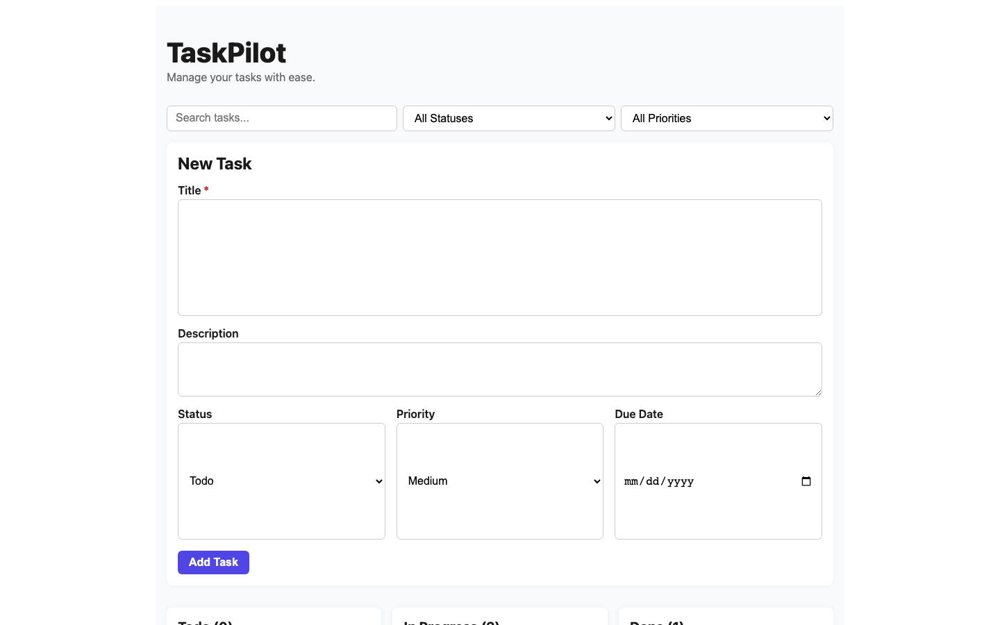
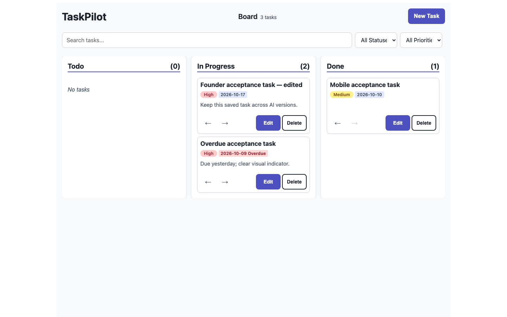
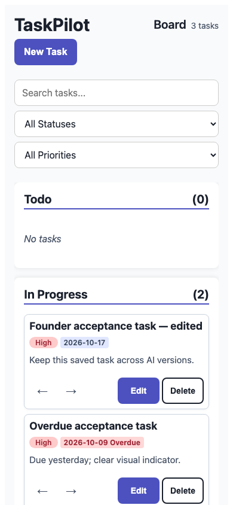
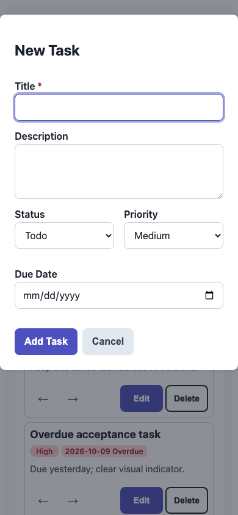

# Real generated interface quality — 10 October 2026

F01 was continued from remote `8ed22f22fbe9f93718527e96bdf3f861382b77d8` on
`codex/f01-commercial-v1`. This pass changes generation guidance and adds browser QA;
it does not rewrite F01, its frontend, database, execution architecture or release
system. Main remains `449b0588e072cda102144c0c629d776049b4f2d2` and PR #1 is unmerged.
The pre-existing `apps/web/next-env.d.ts` difference is preserved and excluded.

## Generation changes

- `apps/api/src/f01/providers/interface_quality.py` supplies reusable product-specific
  direction, typography/color/spacing tokens, compact navigation and editors,
  content above the fold, sensible control sizing, readable cards, wrapping metadata,
  restrained actions, truthful empty/error/no-results states, contrast, keyboard
  dialogs, reduced motion, responsiveness and compatible storage hydration. It
  prescribes neither a palette nor a universal app template and forbids cloned SaaS
  interfaces, unsupported controls and fabricated data/activity.
- Real context planning receives concise proposed visual/interaction criteria. Every
  real source request receives the detailed policy. Keeping these distinct preserves
  the existing planning context/token bounds. Production limits are unchanged.
- Source instructions distinguish a requested visual/feature change from a diagnostic
  repair: implement the complete approved change; limit repairs to observed faults.
  They also describe nullable React 19 DOM refs, explicit editor-open state, a React
  hydration-state gate and local calendar-date comparisons. Existing strict schemas,
  untrusted-context handling, secret rejection, scaffold constraints, exact base
  hashes, source/Brain/version lineage, budgets and sandbox checks remain enforced.
- `apps/web/tests/generated-visual-acceptance.mjs` adds an explicit, bounded browser
  acceptance tool. It captures four real viewports and measures overflow, ordinary
  control dimensions, control text size, optional primary-content placement, and axe
  WCAG A/AA findings. An optional named primary action must open a real semantic
  editor; a visually tidy board alone cannot pass editor acceptance. Coverage and
  scan deadlines are bounded; missing selectors/truncated coverage fail rather than
  claiming verification. Screenshots still require human review.
- CI runs five faithful Chromium harness regressions. Their small HTML fixtures are
  labelled harness tests, **not** generated applications or paid-provider acceptance.
  The visual audit is an explicit acceptance tool alongside functional checks; it is
  not automatically executed by every build worker or a new production release gate.

Usage and limits: [generated interface quality](../../docs/generated-interface-quality.md).

## Real TaskPilot provenance

The existing project `d8147000-9d86-42f0-8deb-4a1e174f57f1` was modified through F01's
actual user-facing request → real OpenAI plan → approval → build/retry workflow.
All application changes came from **OpenAI gpt-4.1-mini**, not hand-edited demo code,
intercepted browser routes, a fixture generator or a synthetic dashboard.

Actual PostgreSQL, leased worker, Docker install/typecheck/build/verifier/runtime and
preview gateway were used. Exact trusted image:
`sha256:bf55945a66450b4d747196aed159eba926ca377b66e41400da70c0a54e3363c0`.
No host mounts, factory secrets, embedded-preview permissions or execution/release
protections were relaxed. Production publishing remains disabled for this environment.

| Published version | Source digest | Result |
| --- | --- | --- |
| v3, existing baseline | `3cca01e90d573ef2e789110f2b925f06440f3aa788e39a538524aa857470b232` | Functional baseline; oversized form and below-fold board |
| v4 | `cc0a17c4e0e711512bf23c6948f5ddec01723a95895331e88947b5a8f0afb0a2` | Docker passed; browser rejected inert New Task and tall editor |
| v5 | `26f19bf5782a5bdad1dd22d4a6f40686675360d846438552b2bbb4bc0f722185` | Editor/hydration fixed; browser rejected contrast and mobile overflow |
| v6 | `de334d2f12672ffe84abbdf5e33d70fd78bd0038b258a1d17631f1d8fcd26925` | Functional/contrast checks passed; 23px hidden-label overflow remained |
| v7, accepted | `0a2f3da39369828ee1226f842f21f06bd7cc025868ee6d3985f108550d76aa58` | Real Docker and all 15 bounded application/browser acceptance checks passed |

Final version ID: `cd8b8a45-b68f-4daf-9b7c-2fc69e60cf65`.
Final successful run: `fc87934c-d2fc-4542-834f-36d379a21414`.
Final execution job: `5e1f092b-7607-4071-8269-a4604473c9c9`, `done / preview_ready`,
zero compiler-repair attempts. All earlier versions remain in the database/history.
Parent digests, source file hashes, pinned request/Brain/plan/base lineage, successful
and failed runs and immutable Docker evidence are in
[build evidence](reports/build-evidence.json). Preview capabilities are redacted.
Generated sources remain in the persistent F01 database; read-only local exports are
`.runtime/taskpilot/source-v1` through `source-v7` and were never rewritten by the audit.

## Reproduced failures and regression evidence

| Actual failure | Root cause and targeted correction | Regression/retest |
| --- | --- | --- |
| v3 inputs/selects grow to 150–168px and board starts below the fold | Shared `flex:1 1 150px` becomes height inside vertical form groups. Guidance puts width distribution on wrappers; actual generated controls use compact sizing. | Faithful browser flex regression; real v7 editor measured at 44px desktop/mobile. |
| First generated patch fails Docker TS2345 | React 19 nullable DOM ref passed to a non-nullable focus-helper signature. Source policy gives nullable ref/null-check convention; subsequent real model patch compiles. | Actual immutable failed Docker diagnostic, provider-payload assertion, later real Docker typechecks/builds pass. |
| v4 New Task does nothing | Modal visibility derived from existing ID/nonempty fields; reset never opens a blank editor. Model uses explicit editor-open state. | Inert-action harness fails; actual v7 New Task opens, validates, creates and closes. |
| v4 first storage write is `[]`, then restored records | Hydration ref becomes true before queued loaded tasks render. Model uses hydration state; malformed JSON cannot overwrite raw storage. | Real observer reproduces write counts `[0,3]`; v7 first write contains all 3 original records, reload/CRUD preserve them; malformed storage test retains raw text. |
| UTC overdue semantics/color-only status | UTC date conversion differs from the user's calendar day. Guidance and generated code use local Y/M/D; explicit Overdue text excludes Done. | Actual Honolulu boundary test uses 9 October locally while UTC is 10 October; unknown extension fields survive editing. |
| v5 card titles squeezed, mobile overflow and contrast errors | Nonshrinking nowrap badges share title row; bright red text/buttons lack contrast. Guidance uses separate wrapping metadata, shrinking children and darker text/surfaces. | Real v5 screenshots/axe failures; faithful card/contrast regression; v7 all four widths and editor scans have zero reported violations. |
| v5 Cancel/Edit Escape lose invoking focus | Cancel closes without recovery; Escape always targets New Task. Guidance saves the actual invoking element. | Actual failures in `reports/v5-keyboard.json`; v7 Tab/Shift+Tab trap, Escape/Cancel/save and New/Edit focus recovery pass. |
| v6 page width exceeds mobile/reflow by 23px | `.filters > * {width:100%}` overrides clipped absolute label/span width. Model scopes the rule to visible controls, without global page overflow masking. | Four actual offending elements in `reports/v6-overflow.json`; standards-mode browser regression; real v7 page width equals viewport at every tested size. |
| Longer policy rejects an otherwise supported long Unicode planning context | Detailed source/CSS policy consumed conservative input budget. Concise planning policy restores headroom; configured bounds are unchanged. | Actual backend failure reproduced; existing long UTF-8 context test plus bounded provider-policy assertion; final full backend suite passes. |

The model also produced an incomplete 8,000-output-token response. It was rejected
without candidate publication or Docker success. Test-only output allowance became
12,000 within existing settings bounds. Local rate/daily/run reservation limits
stopped attempts before dispatch; those failures remain recorded. Test-only allowances
were adjusted, never production defaults or failed evidence. The real-call dollar
ceiling stayed **$0.50**, with the complete journal retained. No uncertain call was
silently replayed and no failed attempt was labelled successful.

## Actual before/after visual review

These are screenshots of the real generated app, with the same saved acceptance
records and viewport dimensions, not design mockups.

| Measurement | v3 before | v7 after |
| --- | --- | --- |
| Desktop 1440×900 board top | 875px | 160px |
| Tablet 768×1024 board top | 875px | 160px |
| Mobile 390×844 board top | 1,296px | 305px |
| Narrow reflow 320×800 board top | 1,340px | 305px |
| Ordinary editor controls | up to 168px | 44px |
| v7 page overflow, all four widths | — | 0px |
| Board axe violations | contrast errors; tablet also target size | 0 reported at all four widths |
| Editor axe violations | v5 contrast errors | 0 reported desktop/mobile |

Before:



After:







Visual assessment: the permanent oversized form no longer dominates the page. A
compact app/Board header, actual count and New Task action lead into the working
board. Full-width titles, separate priority/deadline metadata, visible overdue text,
consistent 44px controls and a compact editor make the application much easier to
scan and operate. Narrow layouts stack without overflow. The understated ink/neutral/
indigo system is more coherent, though still a fairly plain interface. It is **not**
certified as premium purely from test results. Filled Edit actions remain more
prominent than ideal and desktop select labels can appear truncated; those are
remaining visual refinements for founder review. The model did not follow every
stylistic instruction perfectly. One app does not prove universal generation quality.

Complete desktop/tablet/mobile/reflow before/after screenshots and measurements are
under `screenshots/`; v4–v6 retained failures show why compiler success was insufficient.

## Functional, security and accessibility scope

[Actual v7 browser result](screenshots/after/functional.json): **15 passed**, no mocked
model/application/API/browser routes. Tests cover:

- Three actual saved v3 records, exact IDs/fields and reload compatibility; observed
  first writes contain restored records. Disposable tasks alone are deleted.
- New Task/required validation, create/edit/delete and cancellation, all priorities,
  Todo → In Progress → Done/back, search/status/priority filters and no-results reset.
- Due dates, explicit overdue, local-date boundary and Done exclusion; unknown task
  extension fields preserved in a separate disposable context.
- Desktop/mobile CRUD, reload, initial modal focus, repeated Tab/Shift+Tab containment,
  Escape, Cancel/save and invoking-control focus restoration.
- Malformed JSON raw data retained with a warning and disabled writes/actions; actual
  empty/no-results screenshots, no critical console errors or uncaught page exceptions.
- Actual board at four widths plus editor at two widths, compact control dimensions,
  overflow and automated axe checks. A separate founder browser tab retains its
  existing "Founder review — keep across versions" task on v3 → v6 → v7 and refresh.

Axe reports **incomplete** ARIA/contrast checks as well as zero automatic violations;
see each `visual.json`. They require review. Semantic modal/keyboard behavior passes,
but explicit DOM `inert` is not implemented and a human screen-reader audit is not
certified. Physical devices, Safari/Firefox, physical browser zoom, large datasets,
multiple-tab write conflicts, every structurally malformed stored record and all
possible interruption windows are not certified. Browser-local persistence is not
cloud synchronization. The opaque embedded iframe intentionally has temporary
in-memory state; use the standalone native app URL for saved localStorage tasks.

## Fresh checks

| Check | Result |
| --- | --- |
| Full disposable-PostgreSQL backend | 374 passed, 5 explicit opt-in skips, 1 retained Starlette/httpx warning |
| Strict mypy | 113 source files, no issues |
| Frontend regression | 103 passed |
| Generated client | 2 passed; API/client contract drift check passed |
| Typecheck / production frontend build | Passed |
| Planning browser / workspace browser | 14 / 9 passed |
| New bounded visual harness browser regression | 5 passed |
| Exact-image real Docker containment/build/repair/preview regression | 2 passed; its provider responses are controlled, distinctly labelled |
| Real OpenAI TaskPilot v7 Docker/source/runtime/publication | Passed, zero compiler repairs |
| Real TaskPilot v7 browser acceptance | 15 passed; actual app, no route interception |

Logs are under `logs/`. The default backend suite's opt-in skips are three Docker
cases, one live model case and one live Vercel case. Two relevant real Docker cases
were run separately, and this TaskPilot acceptance uses real OpenAI/Docker end to
end. Exact-source production packaging, the separate generic live-model pytest,
Vercel public deploy/redeploy/restore and production authentication were not rerun.
The automatic CI does not imply those dependencies passed. The macOS tool sandbox
blocked Chromium's Mach port; approved local execution ran the browser tests without
changing F01 isolation.

## Measured provider usage and bounded cost

[Provider usage](reports/provider-usage.json) retains every call, actual response
usage and historical reservation, including the incomplete and failed builds.
This quality pass made **10 actual HTTP 200 requests**: 4 planning, 6 source calls.
OpenAI measured **133,778 input + 60,285 output tokens**, zero cached input.
At [gpt-4.1-mini standard prices](https://developers.openai.com/api/docs/models/gpt-4.1-mini)
($0.40/M input, $1.60/M output), the estimate is **$0.1499672**. It is not a billing invoice.

Including the previous TaskPilot acceptance: 17 calls, 171,934 input + 79,783 output,
zero cached input, estimated **$0.1964264**. The dollar ceiling stayed $0.50; the
final call-count ceiling was 18. The acceptance-only guard reserves worst-case cost
before dispatch, settles completed requests against observed uncached usage, and
retains full reservations for unknown outcomes. Historical reservations are retained
rather than resetting the journal. The executed guard is preserved in
`scripts/provider-budget-guard.py`. This is local acceptance instrumentation, not a
production provider implementation change. No credentials or model output are mocked.

## Review and remaining external gates

Running factory workspace: `http://127.0.0.1:57469/projects/d8147000-9d86-42f0-8deb-4a1e174f57f1`.
Open **Open application** for the actual generated TaskPilot and persistent tasks.
The factory and native app tabs are left running when the host remains available.
The latest capability expires **11 October 2026, 11:41 Asia/Ho_Chi_Minh**; exact native
URL is supplied privately in the task response and is excluded from Git.
These are running application URLs, not screenshots or the controlled dashboard.

To repeat this specific browser acceptance against the retained real local profile:

```sh
node QA/generated-ui-quality/scripts/taskpilot-functional.mjs
```

It defaults to private `.runtime/taskpilot/state.json`, the owned persistent browser
profile and `.runtime/taskpilot-quality/recheck` output. Optional private paths:
`F01_TASKPILOT_STATE_PATH`, `F01_TASKPILOT_PROFILE_DIR`,
`F01_TASKPILOT_ACCEPTANCE_OUTPUT`. Do not run simultaneously against the same profile.
It requires these actual saved acceptance records and the compatible TaskPilot UI;
it is not a universal generated-app functional test. Review database-backed source
exports locally rather than copying credentials or preview capabilities into Git.

Actual Google/email/OIDC tenant login and delivery, Vercel publication and production
operations remain unverified here; development identity proves none of them. No
production publication occurred, no branch/main reset occurred, and no public-launch
or bug-free claim is made. The new quality policy improves the generation floor;
stochastic model output and subjective design still require actual acceptance/review.

Code-change commit `b694d4646e6a18cbb27c70e00535adeb309c12d3` passed both automatic
Commercial regression runs:
[PR](https://github.com/NguyenTienThanh2007/F01-local/actions/runs/38024742730),
[push](https://github.com/NguyenTienThanh2007/F01-local/actions/runs/38024739952).
The final evidence commit's exact CI status is recorded in PR #1 and the task's final
response; earlier successful runs are not substituted for its checks.
