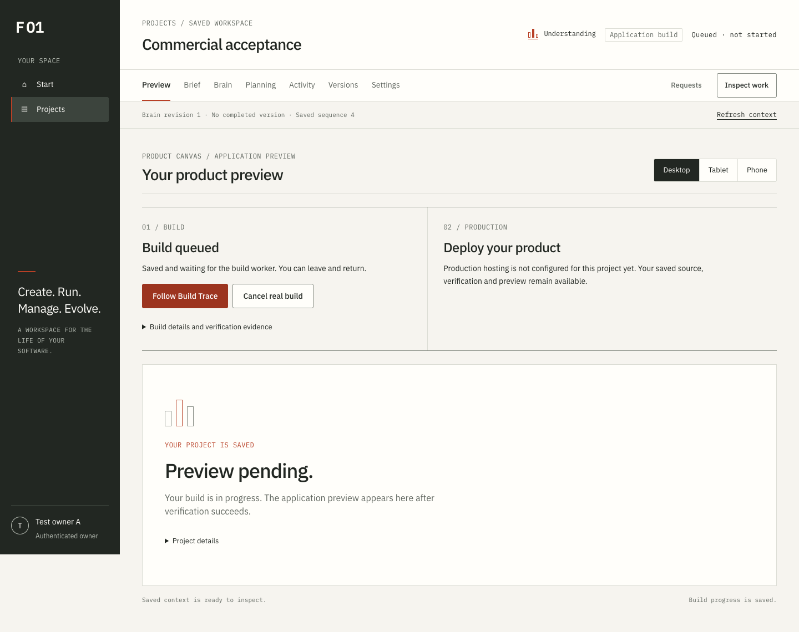
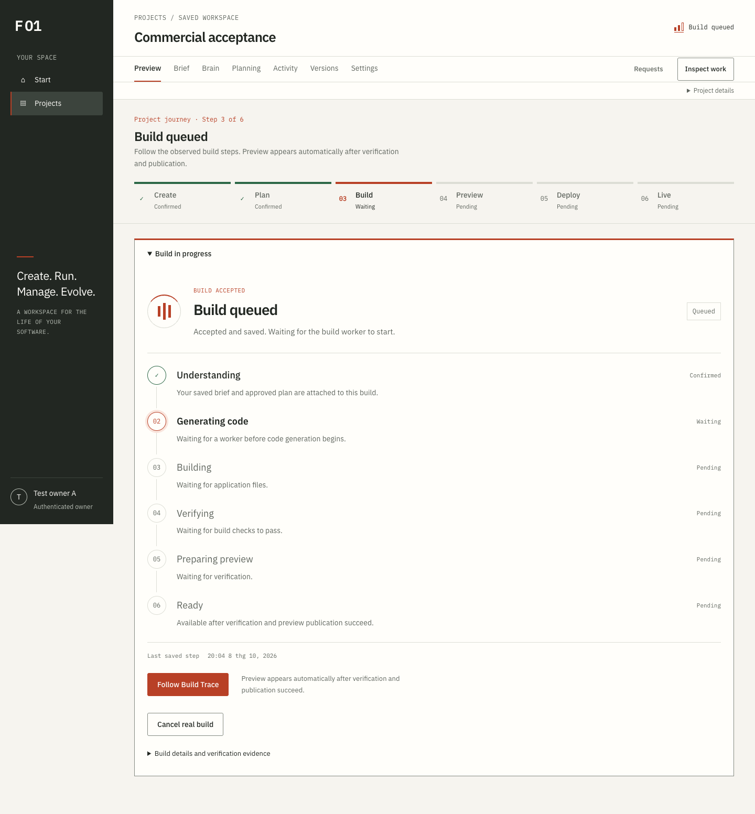

# F01 before / after screenshots

Actual browser captures. Before: 3227ef5. After: final Build/Journey interface at ffb7aa7. Real Docker; controlled identity/model/publisher. No actual Vercel result is implied.

| Surface | Desktop before | Desktop after | Mobile before | Mobile after |
| --- | --- | --- | --- | --- |
| Home | [Before 1440px](before/home-1440.png) | [After 1440px](after/home-1440.png) | [Before 375px](before/home-375.png) | [After 375px](after/home-375.png) |
| Projects | [Before 1440px](before/projects-1440.png) | [After 1440px](after/projects-1440.png) | [Before 375px](before/projects-375.png) | [After 375px](after/projects-375.png) |
| Create | [Before 1440px](before/create-1440.png) | [After 1440px](after/create-1440.png) | [Before 375px](before/create-375.png) | [After 375px](after/create-375.png) |
| Planning | [Before 1440px](before/planning-1440.png) | [After 1440px](after/planning-1440.png) | [Before 375px](before/planning-375.png) | [After 375px](after/planning-375.png) |
| Build | [Before 1440px](before/build-1440.png) | [After 1440px](after/build-1440.png) | [Before 375px](before/build-375.png) | [After 375px](after/build-375.png) |
| Preview | [Before 1440px](before/preview-1440.png) | [After 1440px](after/preview-1440.png) | [Before 375px](before/preview-375.png) | [After 375px](after/preview-375.png) |
| Deploy | [Before 1440px](before/deploy-1440.png) | [After 1440px](after/deploy-1440.png) | [Before 375px](before/deploy-375.png) | [After 375px](after/deploy-375.png) |

Open `gallery.html` for all seven visual comparisons. Actual persisted intermediate/failure/stall Docker-worker screenshots are in `../build-journey/actual-worker/`; their controlled source provider and real worker process-loss provenance are recorded in `../build-journey/real-states.json`.

